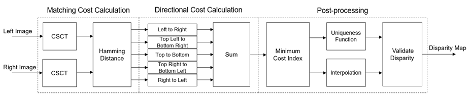

# Stereo Depth Estimation using Semi-Global Block Matching (SGBM) Algorithm

The StereoSGBM algorithm, an advanced form of block matching, calculates disparities in stereo images more accurately and robustly than StereoBM, enabling the reconstruction of detailed 3D scenes from stereo pairs.

## What is Stereo SGBM?
Stereo Semi-Global Block Matching (StereoSGBM) is an advanced algorithm for estimating the depth of a scene from a pair of stereo images. It calculates disparities between corresponding points to reconstruct the scene in 3D.

  

## How it is better than Stereo BM?
StereoSGBM provides more accurate and detailed depth estimation compared to Stereo Block Matching (StereoBM), especially in textured and complex scenes. It implements a more sophisticated block matching technique that takes into account global image features and smoothness constraints.

## How to use my code?
The provided Python script utilizes the StereoSGBM algorithm to perform depth estimation. To use this code:

1. Ensure you have OpenCV and NumPy installed in your Python environment.
2. Set the `Left_Image_Path` and `Right_Image_Path` variables to point to your stereo image pair.
3. Run the script to `Save` or `Display` the generated maps.
